### Typora常用命令（macos版）

最大标题：command + 1 或者：#
大标题：command + 2 或者：##
标准标题：command + 3 或者：###
中标题：command + 4 或者：####
小标题：command + 5 或者：#####
插入表格：command + T
插入代码：command + option +c
行间公式 command + option + b
段落：command + 0
竖线 ： command + option +q
有序列表（1. 2.） ：输入数字+“.”之后输入空格 或者：command + option + o
黑点标记：command + option + u
隔离线shift + command + -
超链接：command + option + l
插入链接：command +k
下划线：command +u
加粗：command +b
搜索：command +f


### JS（let const var）

var let const


1. const声明之后必须赋值
2. 定义的值不能修改，否则报错
3. 支持let其他属性
4. 常量一般要大写

#### 解构赋值


### 原型，原型链

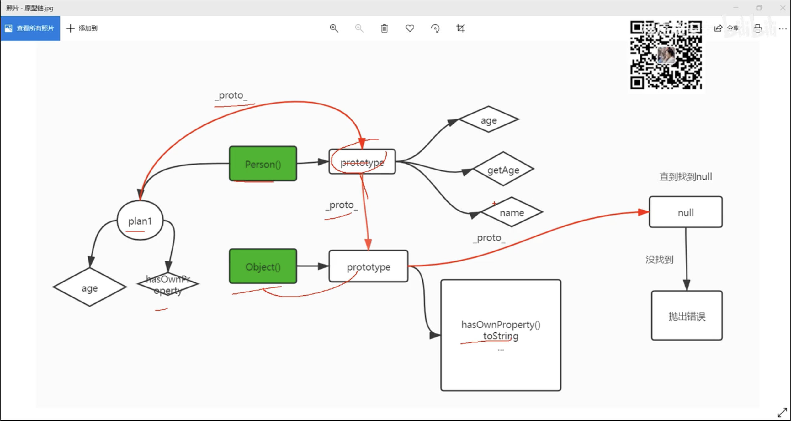

原型 prototype 原型链 _proto_

只有函数特有原型 prototype， 原型链是任何数据类型都有的


### 防抖函数

当持续触发事件，一定时间又没有再触发事件，事件函数才会再执行一次

如果设定的时间在到来之前，又一次触发了事件，就重新开始延时

触发事件一段时间内没有触发，事件执行，肯定就是定时器 

### 节流函数


节流 =》一定时间内多个事件合并为一个事件

防抖 =》固定时间内事件只允许发生一次

### 闭包

1. 延长变量的生命周期
2. 创建私有环境


### Undefined和Null

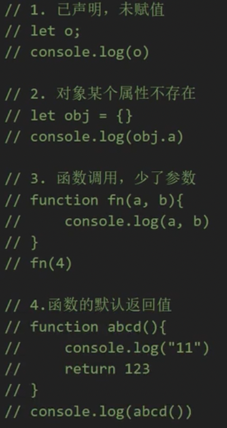

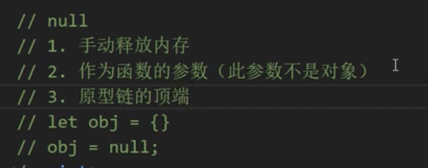

### Vue应用层 V-model

双向数据绑定

### Vue生命周期


beforeCreated()  data和methods还没有初始化，所以一般在这个阶段也不做什么操作

Created() 组件实例化之后，data和methods已经初始化完成了，可以供我们使用，但是模板还没有编译，也就是我们没法获取DOM(因为Vue就是把DOM树解析成虚拟DOM)，通常在这个阶段做一些发送请求的操作

beforeMounted() 该钩子函数在模板渲染之前调用，也就是DOM节点挂载到真实DOM树之前调用，此时模板会进行编译，会调用render函数生成vDOM，也就是虚拟DOM， 此时我们同样无法获取DOM节点

Mounted() 模板已经编译好了，挂载到DOM树上去了，能获取到DOM节点

beforeUpdate() 当我们页面和组件发生变化时，便会执行对应的更新阶段的钩子函数

该钩子函数在data数据发生变化之后调用，此时data里面的数据已经是最新的了，但是页面上DOM还没有更新最新的数据

Updated()  此钩子函数会在数据更新之后执行，而且此时页面渲染也已经完成了，显示的就是最新的数据 <strong>不要在update中修改data数据，很容易造成死循环</strong>

beforeDestroy() 此时组件还没有被销毁，还可以正常使用，我们通常在这个钩子函数里面解除一些全局或者自定义事件

Destroyed() 此钩子函数会在组件实例化销毁之后执行，此时所有组件包括子组件都被销毁了

```js
let x = 10;
let foo = () =>{
  console.log(x);
  let x = 20;
  x++;
}
foo();
// 使用let声明的变量，既不会发生变量提升，同时又存在暂时性死区，所以在块级作用域内，如果使用let声明一个变量，那么该变量在声明之前是不可用的，否则会抛出ReferenceError异常
```

```js
isNaN("100"); //false
isNaN(null); //false
// null 可以转换成为数字，不能转换成NaN
```

### 回流与重绘
1. 浏览器采用流式布局
2. 首先HTML解析成DOM，把CSS解析成CSSOM，把CSSDOM与DOM结合产生render tree
3. 有render tree以后，我们知道了节点样式，然后浏览器会计算节点位置，然后把节点绘制到页面上

####   回流

当我们render tree中的一些元素的结构或者尺寸发生改变，浏览器会重新渲染部分或者全部文档

- 浏览器渲染
- 浏览器窗口发生变化
- 内容变换
- 添加或者删除节点
- 激活css伪类
- clientWidth

#### 重绘

当页面中元素样式的改变不影响它在文档中的位置，浏览器会将新样式赋予元素，这个过程叫做重绘

- background
- visibility

#### 性能影响

总结： 回流的性能消耗比重绘大


display: none 该元素不渲染

visibility: hidden 该元素隐藏，保留位置

overflow: hidden 该元素的子元素超出部分隐藏

opacity: 0 透明度100%


link与@import的区别：

1. link是HTML标签，没有兼容问题；@import是在CSS2.1提出的，低版本的浏览器不支持
2. link可以加载css和js，@import只能加载css
3. link加载内容是与页面同时加载，@import需要页面网页完全载入以后加载


inline和inline-block:

inline不能设置宽和高，inlineblock为行内块级元素，在行内而且可以设置宽高，无论是行内还是外联元素都可以设置padding和margin

链接：https://www.nowcoder.com/questionTerminal/4dc573e2c9f04451973d05459d52ca0d
来源：牛客网

- 行内元素的padding-top、 padding-bottom、 margin-top、 margin-bottom属性设置是无效的 
- 行内元素的padding-left、padding-right、 margin-left、 margin-bottom属性设置是有效的
- 行内元素的padding-top、padding-bottom从 显示的效果上是增加的,但其实设置的是无效的。并不会对他周围的元素产生任何影响。


addEventListener(type, listener[, useCapture]) 事件监听方式

btn.onclick = function(){}


### DOM事件流

 

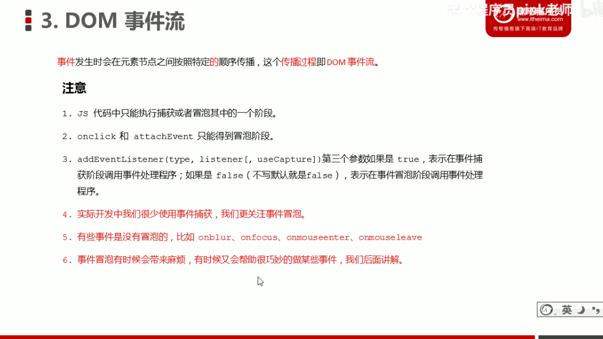

### url到页面渲染

1. 首先是URL地址解析，浏览器会先判断输入是一个合法URL还是一个待处理的关键词，并且根据输入的内容自动完成字符编码
2. 接着发起真正的URL，如果浏览器本地缓存了这个url所需要的资源，则会直接数据发给浏览器进程，如果没有缓存，则会查询DNS域名解析，首先查找浏览器有没有DNS缓存，如果有直接返回IP地址，没有的话会寻找本地的host文件，看看有没有域名记录，如果有则返回IP地址，如果没有回直接向本地DNS服务器请求，如果还没有则会向上的DNS服务器请求，直到返回
3. 浏览器在拿到IP之后，向服务器发起http请求之前，会先和服务器建立TCP连接，

三次握手，请求成功之后就会发送http请求到服务器请求数据了，每个http请求会包含三个部分

1. 请求方法，请求地址和http协议版本
2. 请求头
3. 请求正文


### 作用域链

### 线程和进程的区别和联系

首先进程是包括线程的，进程是操作系统分配资源的基本单位，线程是操作系统调度的基本单位，两者都是为了处理并发这样的场景，进程具有独立性，每个进程具有独立的虚拟地址空间，一个进程挂了不会影响其他进程，但是同一个进程中的多个线程，共享同一个内存空间，如果一个线程挂了，会影响其他线程，甚至导致整个进程崩溃

### RESTFUL API

representational state transfer

资源数✖️操作数 = URL数目

### 301和302状态码区别

301和302[状态码](https://so.csdn.net/so/search?q=状态码&spm=1001.2101.3001.7020)都表示重定向，区别：301重定向是页面永久性转移，表示为资源或页面永久性地转移到了另一个位置，搜索引擎在抓取新内容的同时也将旧的网址替换成重定向之后的网址；

### 跨域问题

接口在一台服务器，前端页面服务在另一台服务器

1. 接口修改响应头
2. Jsonp（blibli）

### cookie sessionstorage localstorage三者区别与联系

cookie数据始终在同源的htto中携带，即在浏览器和服务器中间来回传递

后两者只在本地保存

cookie数据还有路径的概念，即限制cookie在某个路径下，存储大小只有4k

cookie具有极高的扩展性和可用性，通过良好的编程，控制保存在cookie对象的大小

cookie的作用：

- 保存用户登录状态，将用户id保存在一个cookie内，还可以设置过期时间
- 跟踪用户行为，保存上一次访问的地区
- 定制页面，网站如果提供了换肤和更换布局的功能，用cookie记录用户的选项

## Promise 

1. promise是一门新的技术（es6规范）
2. promise是js进行异步编程的新解决方案
3. 具体表达上，promise是一个构造函数
4. 功能上，promise对象用来封装一个异步操作并可以获取其成功或者失败的结果值

异步编程：

- fs文件操作
- 数据库操作
- AJAX
- 定时器

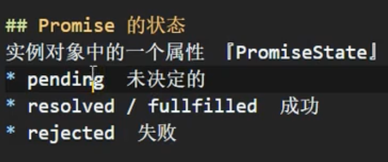


promise状态只能改变一次


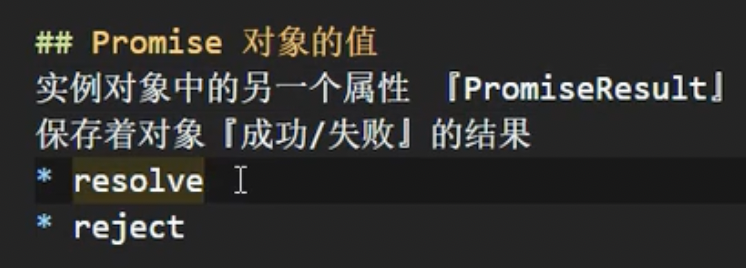


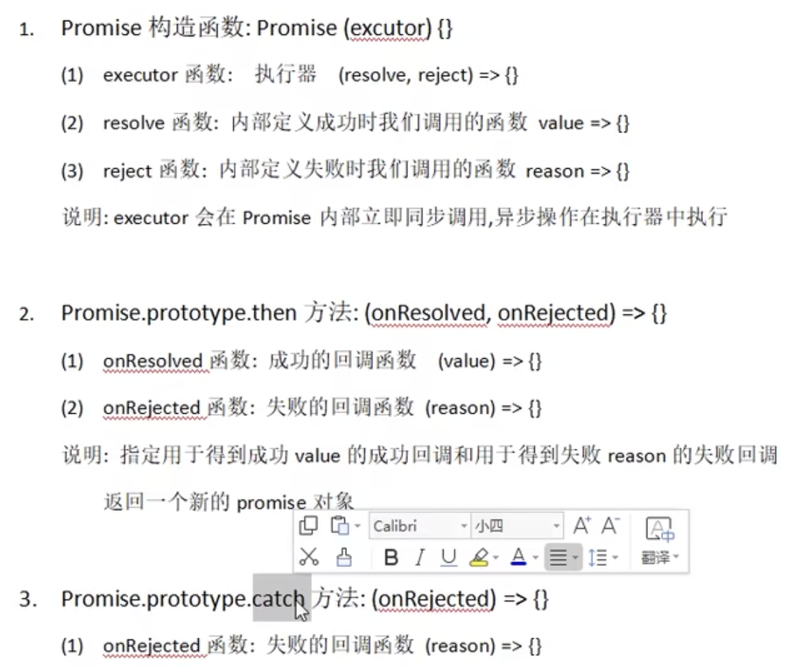

子向父传值：v-on

Vuex是实现组件全局状态管理的一种机制，可以方便组件之间的数据共享

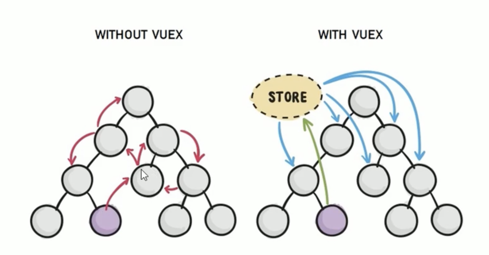

1. 能够在vuex中集中管理共享的数据，易于开发和后台维护
2. 能够高效地实现组件之间的数据共享，提高开发效率
3. 存储在vuex中的数据都是响应式的，能够实时保持数据与页面的同步

一般来说，只有组件之间共享的数据，才有必要存储才vuex中，对于组件中的私有组件，依旧存储在组件自身的data中即可。

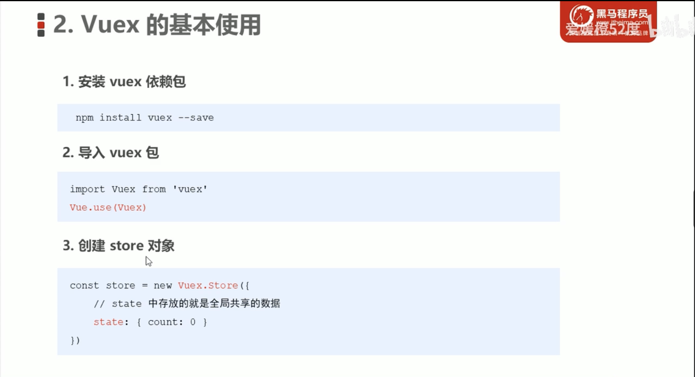

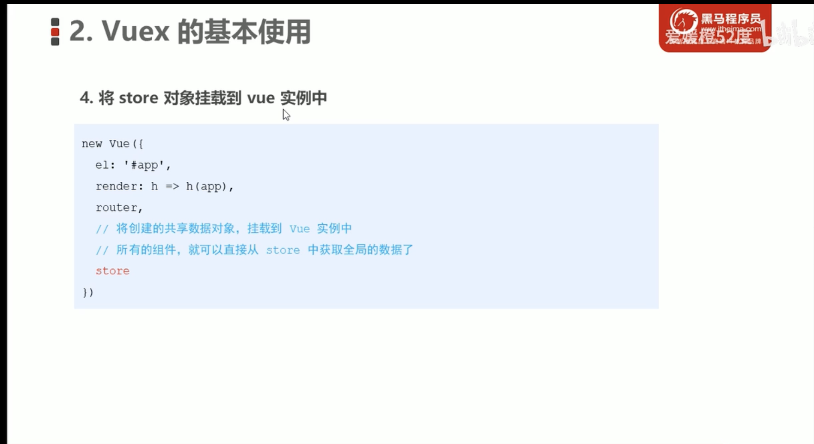


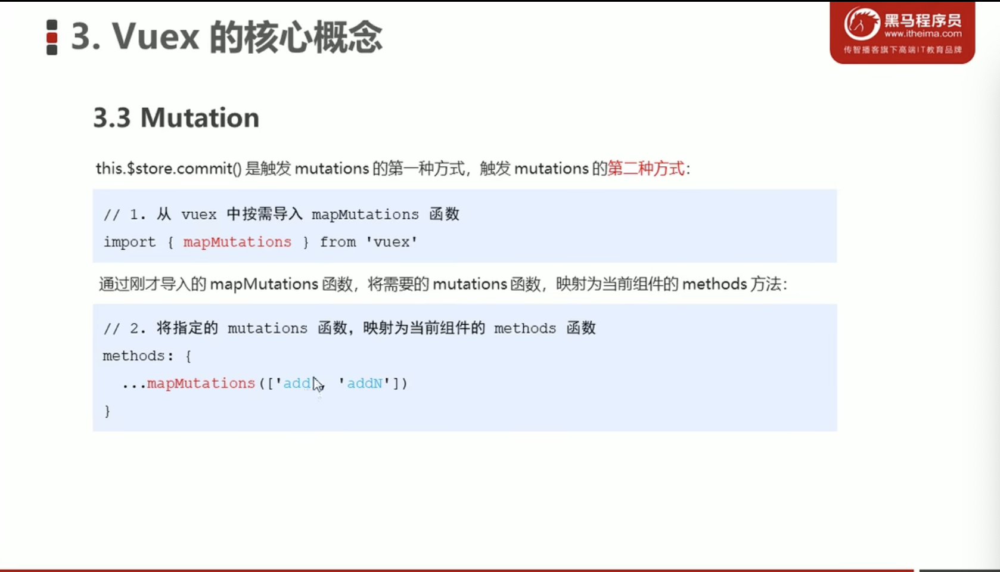

只有mutations中的定义的函数，才能修改state中的数据

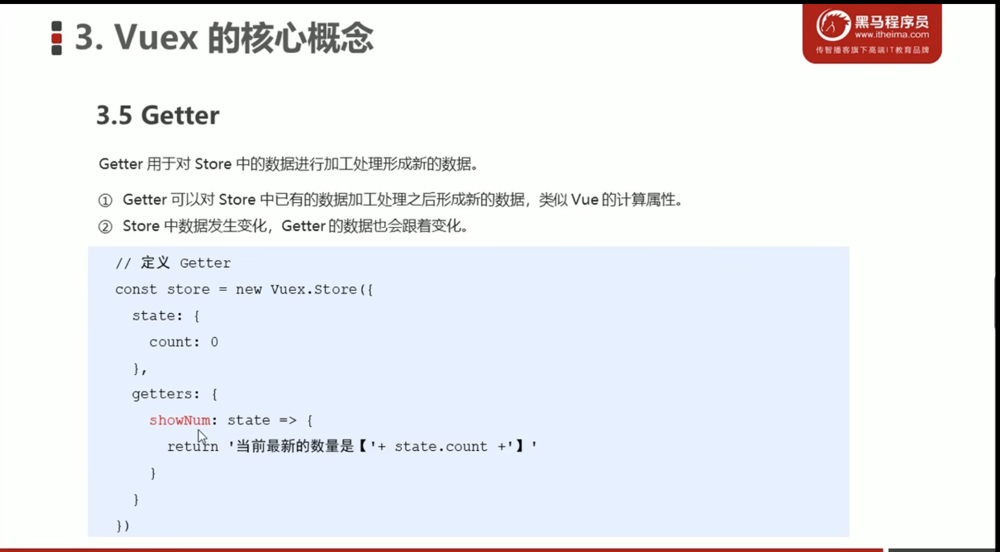

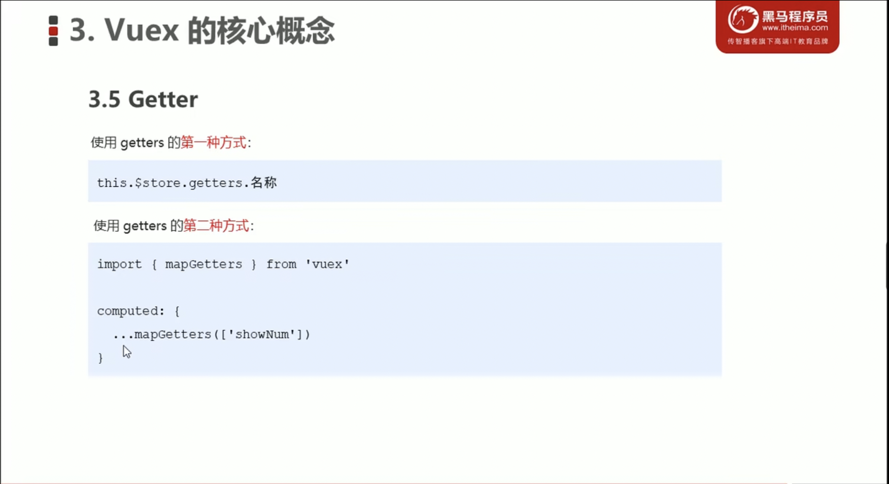

ECMA6 2015 


箭头函数

- 不能作为构造函数实例化对象

- 不能使用arguments变量

- call方法，箭头函数本质是静态变量，无法改变this的指向

- 箭头函数缩写，省略小括号当形参只有一个时候

- 当代码体只有一条语句时候，此时return 必须省略

  ```js
  let add = n => {
    return n + n;
  }
  let pow = (n) => n*n;
  ```

  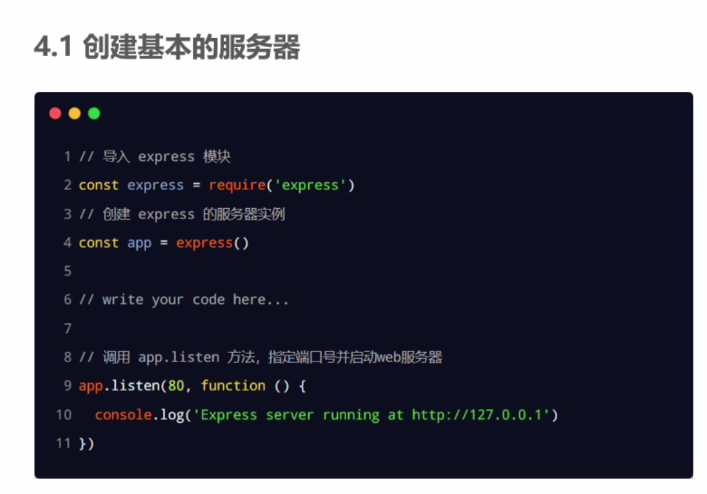

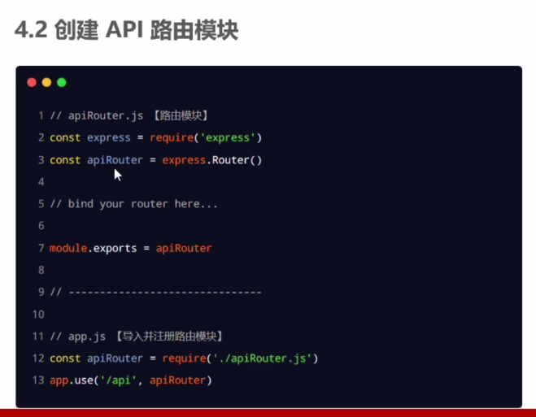

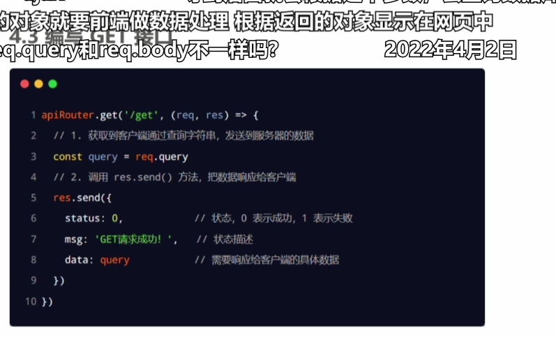

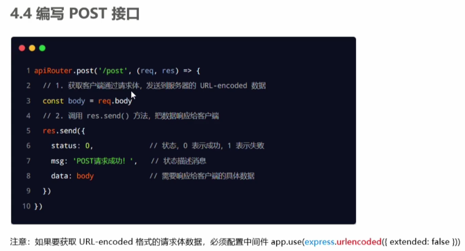


```js
// 冒泡排序
let arr = [15, 2, 321, 12, 34, 5];
const n = arr.length;
var bubbleSort = function (arr) {
  for (let i = 0; i < n-1; i++) {
    for (let j = 0; j < n - i - 1; j++) {
      if (arr[j] > arr[j+1]) {
        let temp = arr[j+1];
        arr[j+1] = arr[j];
        arr[j] = temp;
      }
    }
  }
  return arr;
};
console.log(bubbleSort(arr));
// (1) 2 15 12 34 5 321
// (2) 2 12 15 5 34 321
// (3) 2 12 5 15 34 321
// (4) 2 5 12 15 34 321
```

事件扩展符应用：0

1. 数组去重 [new Set(...arr)]
2. 数组拷贝 [...arr]
3. 伪数组转换真数组
4. 数组扁平化


CSRF跨站点请求伪造


null和undefined的区别

null代表空值，undefined代表声明了但是没有被赋值

undefined不是关键字，但null是关键字（js关键字break, if, this, do, case, catch, finally, new, typeof, else, ）

undefined == null true

undefined本质上是window的一个属性，null是一个对象

undefined通常出现在： 声明变量没有赋值，函数没有设置返回值，引用没有赋值的对象属性


linux杀死进程

```shell
ps -ef | grep nginx
kill -9 xxxx
```


刚刚看了方应杭的关于前端发展历程的视频，涵盖了从浏览器大战，到中国企业转型互联网，再到09年左右nodejs, npm, commonjs的诞生，以及10年开始，angular, react和vue框架的兴起的过程，感觉到技术发展真的是日新月异，在当时看来非常火热的技术可能几年内就会变得无人知晓，背后本质都是利益的驱动，消费者选择了什么样的产品，影响了市场份额，以及公司保护自己的产品而推出技术壁垒和发起技术标准，还有印象很深的是，现在国内互联网的巨头最早基本都不是做这个的，阿里最早做的是中国黄页，京东是B2C的3C业务，就是面向消费者卖一些电子产品，腾讯更离谱，最早做的是bb机，然后是qq这样即时通讯软件和游戏，最后转向了互联网。
