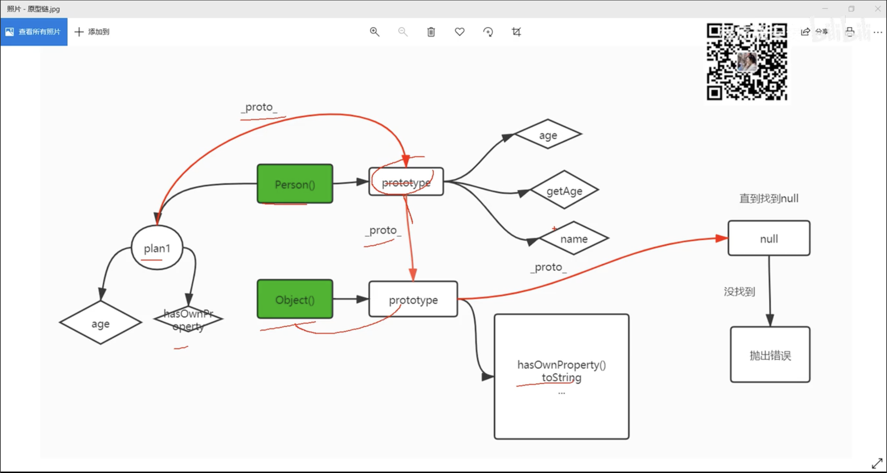

最大标题：command + 1 或者：#
大标题：command + 2 或者：##
标准标题：command + 3 或者：###
中标题：command + 4 或者：####
小标题：command + 5 或者：#####
插入表格：command + T
插入代码：command + option +c
行间公式 command + option + b
段落：command + 0
竖线 ： command + option +q
有序列表（1. 2.） ：输入数字+“.”之后输入空格 或者：command + option + o
黑点标记：command + option + u
隔离线shift + command + -
超链接：command + option + l
插入链接：command +k
下划线：command +u
加粗：command +b
搜索：command +f

### JS（let const var）

var let const

1. const声明之后必须赋值
2. 定义的值不能修改，否则报错
3. 支持let其他属性
4. 常量一般要大写

#### 解构赋值

### 原型，原型链

原型 prototype 原型链 _proto_

只有函数特有原型 prototype， 原型链是任何数据类型都有的

### 防抖函数

当持续触发事件，一定时间又没有再触发事件，事件函数才会再执行一次

如果设定的时间在到来之前，又一次触发了事件，就重新开始延时

触发事件一段时间内没有触发，事件执行，肯定就是定时器 

### 节流函数

节流 =》一定时间内多个事件合并为一个事件

防抖 =》固定时间内事件只允许发生一次

